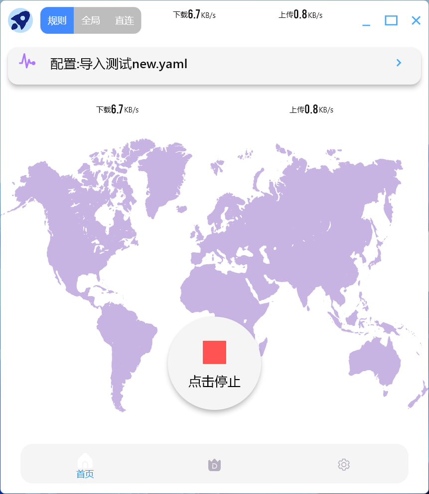
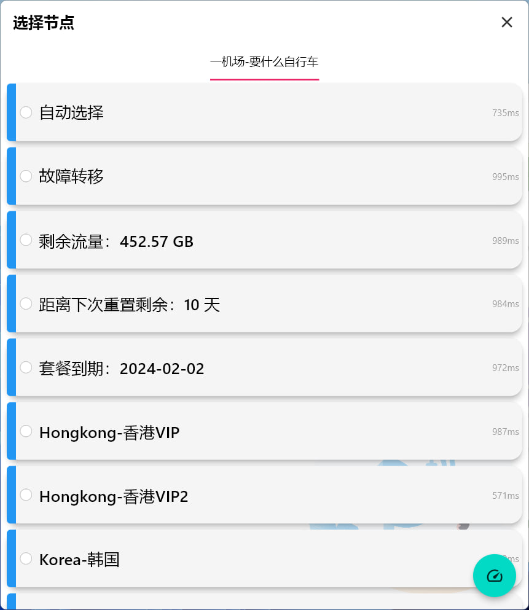
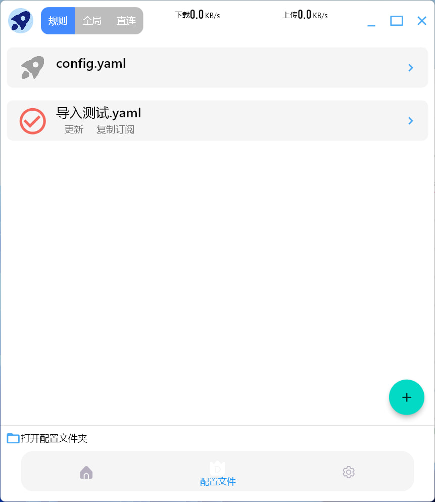
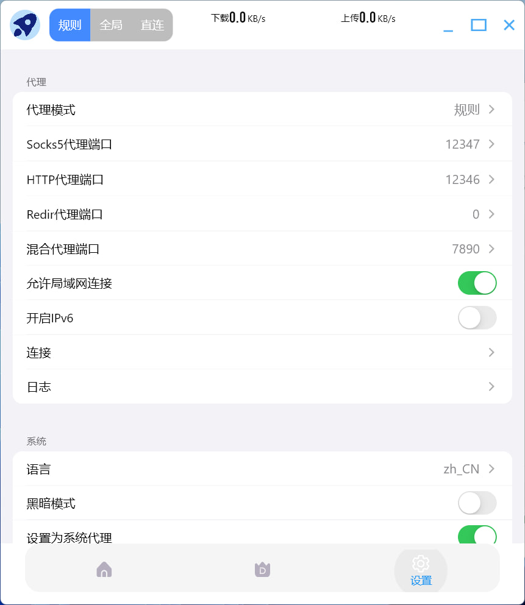
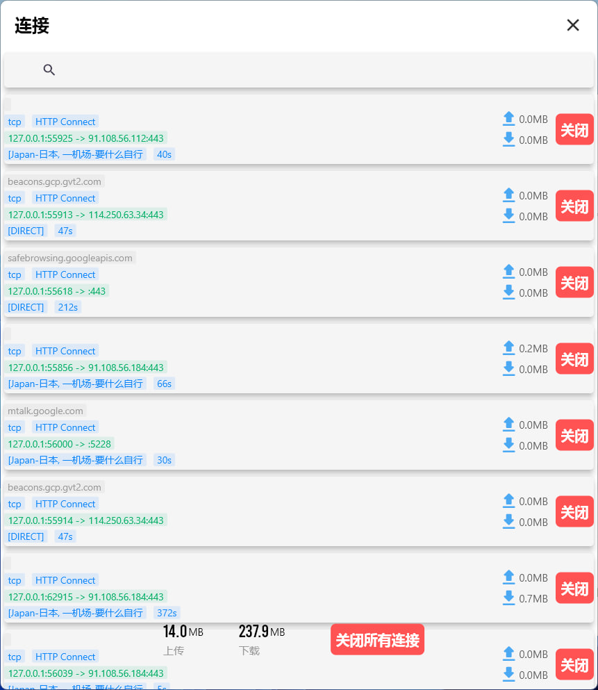

# ClashCross

ClashCross is a proxy debugging application built on the Clash core.

We do not provide any services for it, so please refrain from giving feedback on any issues not related to the application's own usage.

 Android(Beta) / Windows / macOS / Linux(amd64/arm64) / Supported!

<a href="README.md">
      English
      </a><a href="README_zh.md">
      简体中文
      </a>

 # Install
## Android

or download .apk directly. [https://github.com/shipinbaoku/ClashCross/releases](https://github.com/shipinbaoku/ClashCross/releases)
## Windows

Please download .exe setup directly. https://github.com/shipinbaoku/ClashCross/releases

## Macos

Please download .dmg setup directly. [https://github.com/shipinbaoku/ClashCross/releases](https://github.com/shipinbaoku/ClashCross/releases)

## Linux

- snap:
  - `snap install clashcross`
  - 
- deb:
  - `sudo apt install libappindicator3-dev` 
  - 
then

  - `sudo dpkg -i clashcross.deb`
  
## Windows

Please download .exe setup directly. [https://github.com/shipinbaoku/ClashCross/releases](https://github.com/shipinbaoku/ClashCross/releases)

# Screen
- Home

  

- Proxy

  
- Profile

  
- Setting

  
- Connections

  
- Logs

  

# Thinks for:
- [clash](https://github.com/Dreamacro/clash)
- [flcash](https://github.com/Fclash/Fclash)
- [flutter](https://github.com/flutter/flutter)

## License
