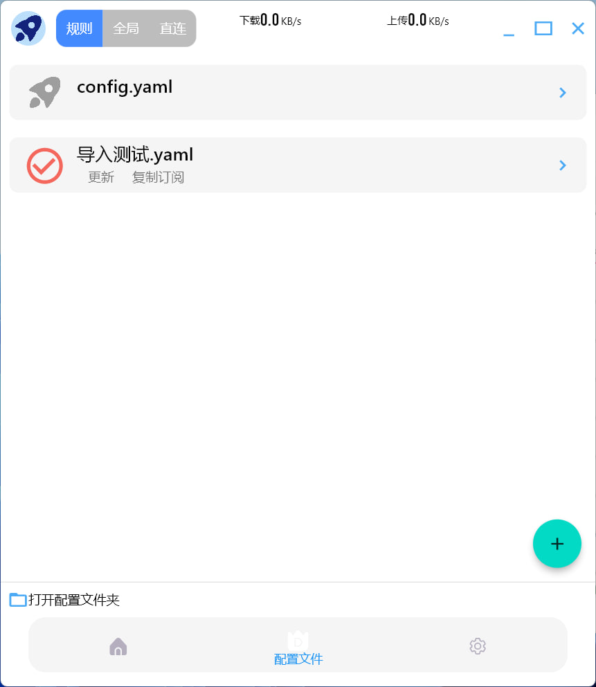
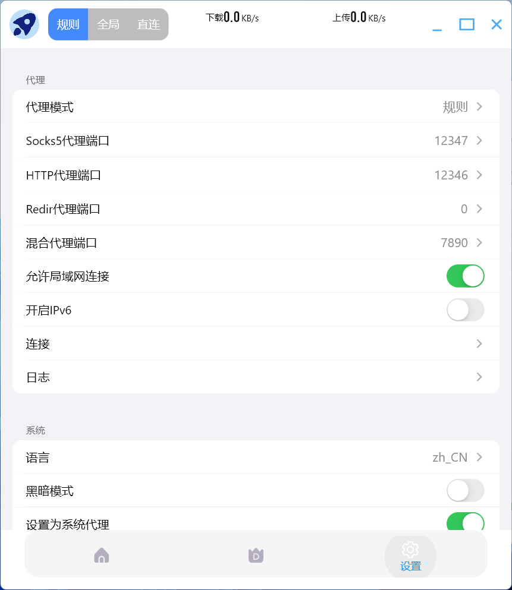

# ClashCross

ClashCross是基于Clash核心构建的代理调试应用。

我们不提供任何相关服务，请不要反馈与应用本身使用无关的问题。

支持Android（测试版）/ Windows / macOS / Linux（amd64/arm64）！

<a href="README.md">
      English
      </a><a href="README_zh.md">
      简体中文
      </a>

# 安装

## Android

或直接下载.apk文件。[https://github.com/shipinbaoku/ClashCross/releases](https://github.com/shipinbaoku/ClashCross/releases)

## Windows

请直接下载.exe安装文件。https://github.com/shipinbaoku/ClashCross/releases

## Macos

请直接下载.dmg安装文件。[https://github.com/shipinbaoku/ClashCross/releases](https://github.com/shipinbaoku/ClashCross/releases)

## Linux

- snap包：
    - `snap install clashcross`
    - 
- deb包：
    - `sudo apt install libappindicator3-dev`
    - 
然后

    - `sudo dpkg -i clashcross.deb`

## Windows

请直接下载.exe安装文件。[https://github.com/shipinbaoku/ClashCross/releases](https://github.com/shipinbaoku/ClashCross/releases)

# 界面预览

- 主页

  
- 代理

  
- 配置文件

  
- 设置

  
- 连接信息

  
- 日志

  

# 致谢：

- [clash](https://github.com/Dreamacro/clash)
- [flcash](https://github.com/Fclash/Fclash)
- [flutter](https://github.com/flutter/flutter)